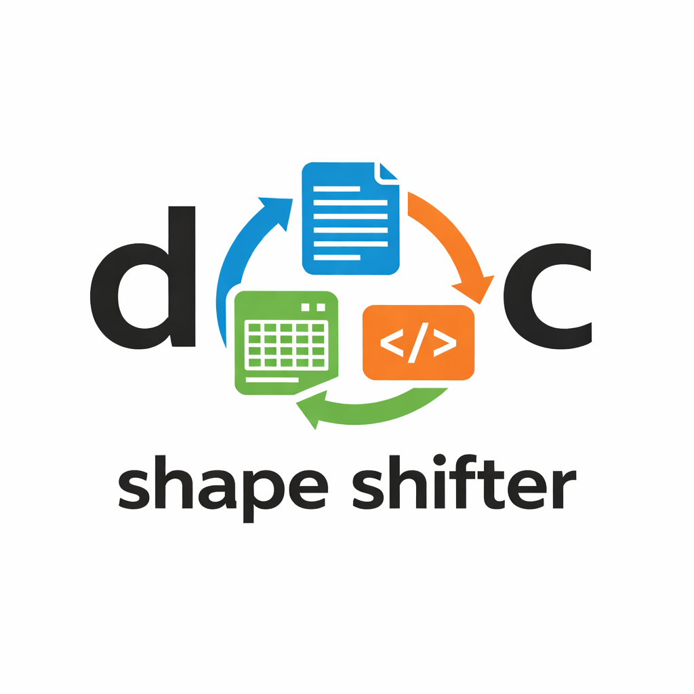

<p align="center">
  
</p>

# doc-shape-shifter

`doc-shape-shifter` is a local-first document conversion toolkit for macOS that routes each conversion through the best available engine instead of forcing one tool to handle every format pair.

The current MVP focuses on the first-line formats from Section 4 of the ecosystem survey and is structured as a real Python package so the repo can grow beyond document conversion into OCR, OTR, OMR, image restoration, and related multimodal pipelines.

## Repository Layout

```text
doc-shape-shifter/
├── README.md
├── docs/
│   ├── prd.md
│   ├── tech-spec.md
│   ├── user-manual.md
│   └── research/
├── scripts/
│   ├── bootstrap_mac_m4.sh
│   ├── build_release_zip.sh
│   └── sync_repo.sh
├── src/
│   └── doc_shape_shifter/
│       ├── __main__.py
│       ├── cli.py
│       ├── core/
│       ├── engines/
│       ├── ocr/
│       ├── otr/
│       ├── omr/
│       ├── restoration/
│       └── pipelines/
├── tests/
├── pyproject.toml
└── uv.lock
```

## What The Project Does

- Detects source and target formats from file extensions or explicit flags.
- Inspects the local machine for available conversion engines.
- Ranks candidate routes before executing the best one.
- Supports direct conversions where that is the highest-fidelity path.
- Falls back to a lightweight intermediate representation for multi-step conversions.

## Current MVP Scope

Supported target/source families in the MVP:

- `pdf`
- `docx`
- `pptx`
- `xlsx`
- `html`
- `json`
- `csv`
- `md`
- `tex`
- `epub`
- `txt`

Primary engines used by the router:

- `pandoc` for direct text-like conversions and final rendering.
- `pymupdf4llm` for fast native-text PDF extraction.
- `docling` for broad PDF and Office parsing.
- `tabula-py` for PDF table extraction into CSV.
- `Mathpix` as an optional future-facing specialist for math-heavy OCR.

## Why This Structure

The repo follows standard Python packaging practice:

- `src/` layout for import safety and future PyPI publication.
- `docs/` for all authored documentation and research artifacts.
- `tests/` isolated from package code.
- `scripts/` for repeatable operational tasks.

The package also includes reserved namespaces for future work:

- `ocr/`
- `otr/`
- `omr/`
- `restoration/`
- `pipelines/`

Those directories are intentionally lightweight now, but they define the expansion boundaries cleanly.

## Current Sync State

As verified on `2026-03-31`, local `main` and `origin/main` both resolved to:

- Commit: `6b3c02b6b369fe169957af931a6b56753f0a4d08`
- Commit date: `2026-03-29T12:59:27-04:00`
- Subject: `Initial commit`

If you have local uncommitted work, use the sync workflow below instead of a blind pull.

## Installation

### 1. Clone Or Sync The Repository

If you do not have the repo yet:

```bash
mkdir -p ~/code
git clone https://github.com/jon-chun/doc-shape-shifter.git ~/code/doc-shape-shifter
cd ~/code/doc-shape-shifter
```

If you already have it locally and want to sync safely:

```bash
cd ~/code/doc-shape-shifter
git status --short
git stash push -u -m "pre-sync backup"   # only if needed
git fetch origin
git switch main
git pull --ff-only origin main
git stash pop                             # only if you used stash
```

Or use:

```bash
bash ./scripts/sync_repo.sh
```

### 2. Install System Prerequisites

This project targets Apple Silicon macOS and currently expects:

- Homebrew
- `uv`
- `pandoc`
- Java
- a PDF engine for Pandoc output, such as `tectonic` or `pdflatex`

Recommended install:

```bash
brew install pandoc openjdk uv tectonic
```

If you already have TeX Live installed, `pdflatex` is also acceptable.

### 3. Create The Python Environment

```bash
cd ~/code/doc-shape-shifter
uv venv --python 3.12 .venv
uv sync --extra dev
```

### 4. Verify The Toolchain

```bash
uv run dss --list-backends
```

Expected backends:

- `builtin` — always available (Python stdlib)
- `pandoc` — requires `pandoc` on PATH
- `pymupdf` — installed via core dependencies
- `docling` — optional (`pip install docling`)
- `markitdown` — optional (`pip install 'markitdown[all]'`)
- `tabula` — optional (requires `tabula-py` + Java)
- `mathpix` — optional (requires API credentials)

The long-form command `uv run doc-shape-shifter --list-backends` also works.

If `mathpix` shows unavailable, that is normal unless you intentionally configured it.

## Configuration

### Optional Mathpix Credentials

Copy the variable names from `.env.example` into your shell environment manager:

```bash
export MATHPIX_APP_ID="your-app-id"
export MATHPIX_APP_KEY="your-app-key"
```

Mathpix is not required for the current local-first MVP.

### PDF Rendering Notes

Conversions that end in `pdf` use Pandoc plus a PDF engine:

- `tectonic`
- `pdflatex`
- `wkhtmltopdf`

The router only checks availability. If PDF generation fails, inspect the Pandoc error and verify your selected engine works standalone.

## Commands

### Show Installed Backends

```bash
uv run dss --list-backends
```

Use this first whenever something fails.

### Show Supported Conversion Pairs

```bash
uv run dss --list-formats
```

Lists all source/target format pairs and which backends handle each.

### Convert A File

```bash
uv run dss input.pdf output.md
uv run dss input.docx output.html
uv run dss input.md output.pdf
uv run dss input.csv --to json
```

### Force A Specific Backend

```bash
uv run dss input.pdf output.md -b pymupdf
uv run dss input.docx --to md -b pandoc
```

### Disable Fallback

```bash
uv run dss input.pdf output.md --no-fallback
```

Only tries the first backend in the chain; does not fall through on failure.

### Verbose Output

```bash
uv run dss input.pdf output.md -v      # INFO level
uv run dss input.pdf output.md -vv     # DEBUG level
```

## How To Interpret Output

### `--list-backends`

Shows each backend name, whether it is installed (`Yes`/`No`), and its version string.

### `--list-formats`

Shows every defined conversion pair and the ordered backend chain (best first, fallbacks after).

### Conversion Output

On success, prints the source/target formats, which backend was used, elapsed time, and output file size. On failure, all backend errors are aggregated so you can see which engine broke and why.

## Routing Rules In The MVP

- Same-format conversions are file copies.
- `pdf -> csv` prefers `tabula-py`.
- `md/html/docx/epub/latex/csv -> docx/pdf/html/epub/md/txt/tex` prefers direct `pandoc`.
- `pdf -> md/txt/html/json` prefers `pymupdf4llm`, then falls back to `docling`.
- `pdf/docx/pptx/xlsx/html/txt -> docx/pdf/epub/md/txt/json` can flow through extracted Markdown and Pandoc rendering.
- `json` and `csv` use native adapters when that is cleaner than invoking heavier tooling.

## Documentation

- Product requirements: [docs/prd.md](/Users/jonc/code/doc-shape-shifter/docs/prd.md)
- Technical specification: [docs/tech-spec.md](/Users/jonc/code/doc-shape-shifter/docs/tech-spec.md)
- User manual: [docs/user-manual.md](/Users/jonc/code/doc-shape-shifter/docs/user-manual.md)
- Research survey and notes: [docs/research](/Users/jonc/code/doc-shape-shifter/docs/research)

## Development

Run tests:

```bash
uv run pytest
```

Run lint:

```bash
uv run ruff check
```

Run as a module:

```bash
uv run python -m doc_shape_shifter doctor
```

## Packaging And Release Archive

To build a local project zip that excludes ignored junk and captures the repo contents cleanly:

```bash
bash ./scripts/build_release_zip.sh
```

It writes a zip file into `dist/`.

## Known Limits

- `pptx` and `xlsx` currently depend on `Docling`.
- `pdf -> csv` is table extraction, not full semantic PDF reconstruction.
- `Mathpix` is optional and not part of the default local path.
- Some format pairs are structurally lossy. The router aims for the least-lossy available path, not perfect round-tripping.

## Recommended Next Steps

1. Add regression fixtures under `tests/fixtures/`.
2. Add explicit scanned-PDF benchmarks and OCR fallback thresholds.
3. Add separate engine modules for future OCR, OTR, OMR, and restoration pipelines.
